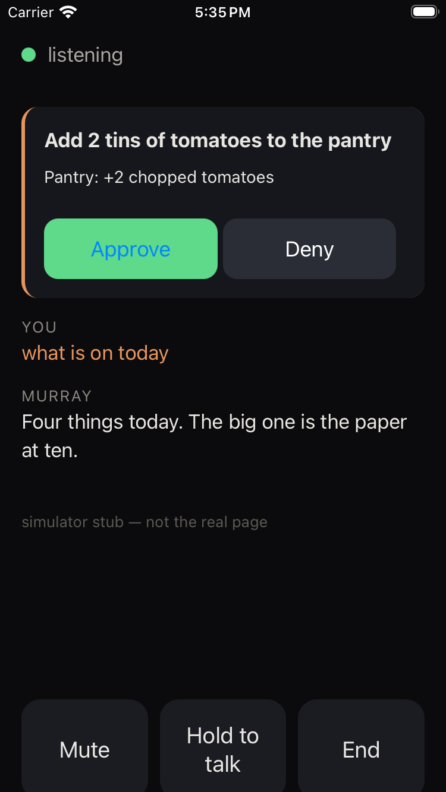
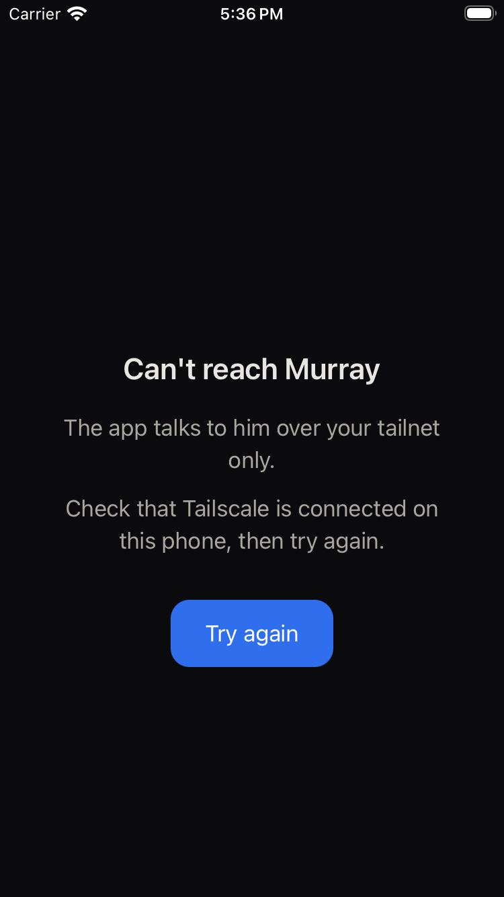

# Murray — iPhone shell

A Capacitor 8 iOS app that wraps a private, tailnet-only voice page in a
native `WKWebView`, so the page can get what a Safari tab cannot: a
microphone that keeps working with the screen locked (now) and, later,
the ability to ring the phone (VoIP push).

This repo is public only so GitHub's free Mac runners can build it. It
contains **no URL, no secret, no server code**. The page the app loads is
supplied at build time from the `TALK_URL` repository secret by
`scripts/configure.sh`, which refuses to run without one. The page itself
authenticates every request separately (a path secret plus the identity
header Tailscale stamps), so possessing this code grants nothing.

## Layout

- `capacitor.config.template.json` — `server.url` is `__TALK_URL__` until build.
- `www/index.html` — the offline fallback shown when the page cannot load.
- `ios/` — generated by `npx cap add ios` (works on Linux with SPM; Xcode
  is only needed to build). `Info.plist` declares the microphone purpose
  string, `UIBackgroundModes: audio`, portrait only, and ATS local
  networking only (so a simulator build can load the stub at 127.0.0.1).
- `scripts/configure.sh` — writes `capacitor.config.json` from `$TALK_URL`.
- `scripts/render_assets.mjs` — icon and splash from `resources/*.svg`,
  rasterised with Playwright (no native image libraries).
- `scripts/stub_talk.py` — a static look-alike page for the simulator job.
- `.github/workflows/ios-app.yml`:
  - **simulator** (every push): unsigned build on `macos-15`, booted in an
    iPhone simulator against the stub, uploads `sim-1-start.png`,
    `sim-2-offline.png`, `launch.mp4` and the `.app` zip as artifacts.
  - **testflight** (only when the App Store Connect secrets exist):
    automatic signing with the API key, export, `altool` upload. No
    fastlane, no certificates in git, no App Store review.
- `tests/test_app_shell.py` — the placeholder stays in git, configure
  refuses empty/non-https and never prints the URL, the plist declares
  what it must, the workflow gates signing and shreds the key, the stub serves.

## Secrets (Settings → Secrets and variables → Actions)

`TALK_URL`, `APPLE_TEAM_ID`, `ASC_ISSUER_ID`, `ASC_KEY_ID`,
`ASC_KEY_P8` (base64 of the `.p8`, one line). Step-by-step in `docs/SETUP.md`.

## Not verified without a device

Whether `WKWebView` keeps `getUserMedia` alive with the screen locked
under the `audio` background mode. The entitlement is declared; the first
real launch answers it.

## What the simulator job produced (run #1)

| loaded the stub page | tailnet unreachable → fallback |
|---|---|
|  |  |

Both are real iOS renders from the `macos-15` runner's iPhone simulator,
not browser mock-ups. The full run also uploads `launch.mp4` and the
`.app` zip as artifacts.
